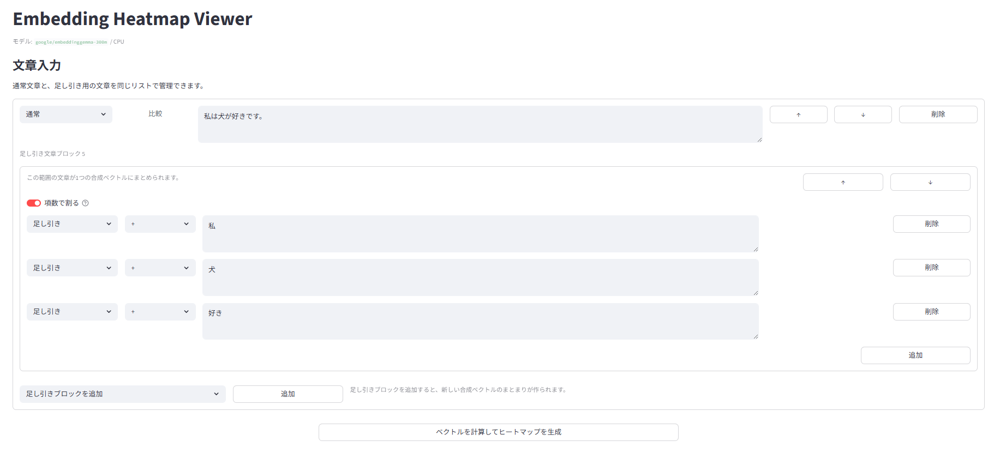
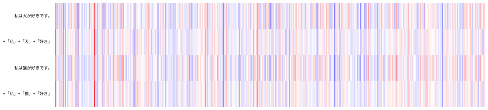
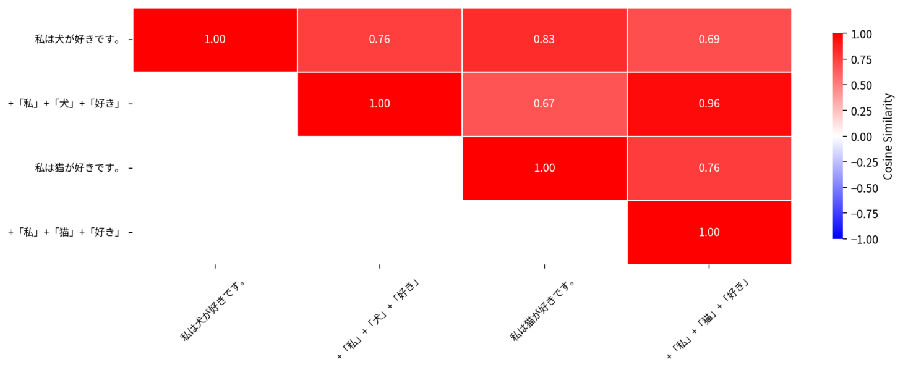

# Embedding Heatmap Viewer

Streamlit で動く、文章埋め込み可視化アプリです。  
`google/embeddinggemma-300m` を CPU で使い、通常文章と足し引き文章ブロックのベクトルを比較できます。


## Overview

- 通常文章をそのままベクトル化して比較
- 複数の短文を `+` / `-` で合成し、1つのベクトルとして比較
- 足し引きブロックを複数作成可能
- ブロック順を並び替え可能
- 比較対象ベクトル同士のコサイン類似度を可視化

## Screenshots

### Top Page

入力画面では、通常文章と足し引きブロックを同じリスト上で管理できます。



### Heatmap

比較表示では、入力順を保ったまま通常文章と足し引きブロックの合成結果を並べて可視化します。  
全体表示では、それに加えて足し引きブロック内の各要素も表示します。



### Cosine Similarity

比較表示に含まれるベクトル同士について、コサイン類似度の上三角行列を描画します。



## Example Use Case

たとえば次のような比較ができます。

- 通常文章: `私は犬が好きです。`
- 足し引きブロック: `+「私」+「犬」+「好き」`

このときアプリでは、次の2つを主に比較できます。

- 元の文 `私は犬が好きです。`
- 分解して合成した `+「私」+「犬」+「好き」`

## Features

- 通常文章と足し引きブロックを同じ画面で管理
- 足し引きブロック内で文章を追加
- ブロックごとに `項数で割る` トグルを設定
- 比較表示と全体表示の2種類のヒートマップ
- 比較表示に対するコサイン類似度ヒートマップ
- 類似度上位ペアの一覧表示

## Requirements

- Python 3.12 付近
- CPU 実行
- 初回起動時に Hugging Face からモデルをダウンロードできるネットワーク環境

主な依存:

- `streamlit`
- `sentence-transformers`
- `torch`
- `matplotlib`
- `seaborn`
- `numpy`

## Setup

```bash
python -m venv .venv
./.venv/bin/pip install streamlit sentence-transformers torch matplotlib seaborn numpy
```

## Run

```bash
./.venv/bin/streamlit run app.py
```

ブラウザで表示された URL を開くとアプリが使えます。

## UI Structure

### 1. 通常文章

- 文章そのものを比較対象として追加
- 行単位で並び替え可能

### 2. 足し引きブロック

- `+` / `-` を持つ複数文をまとめて1つのベクトルに変換
- ブロックごとに独立して管理
- ブロック単位で並び替え可能
- `項数で割る` をオンにすると、足し引き後のベクトルを項数で割る

### 3. ヒートマップ

- カラーマップは `bwr`
- 左側に文章ラベルを表示
- 比較表示はブロック順を維持して描画

## How Composition Works

足し引きブロックのベクトルは、各文の埋め込みベクトルを求めたあとで符号付き和として合成します。

```text
+「私」+「犬」-「猫」
```

`項数で割る` をオンにした場合のみ、合成後のベクトルを項数で割ります。

## Cosine Similarity

比較表示に含まれるベクトルについて、コサイン類似度を計算して表示します。

- 上三角ヒートマップ
- 類似度が高い上位ペア

どの通常文章とどの合成ベクトルが近いかを確認しやすくしています。

## Files

- `app.py`: Streamlit アプリ本体
- `README.md`: この説明ファイル
- `img/top_page.png`: トップ画面
- `img/heatmap.png`: ヒートマップ表示
- `img/matrix.png`: コサイン類似度行列

## Notes

- 初回はモデルダウンロードに時間がかかります
- GPU ではなく CPU 前提です
- 入力数が多いとヒートマップや類似度行列が縦長になります
